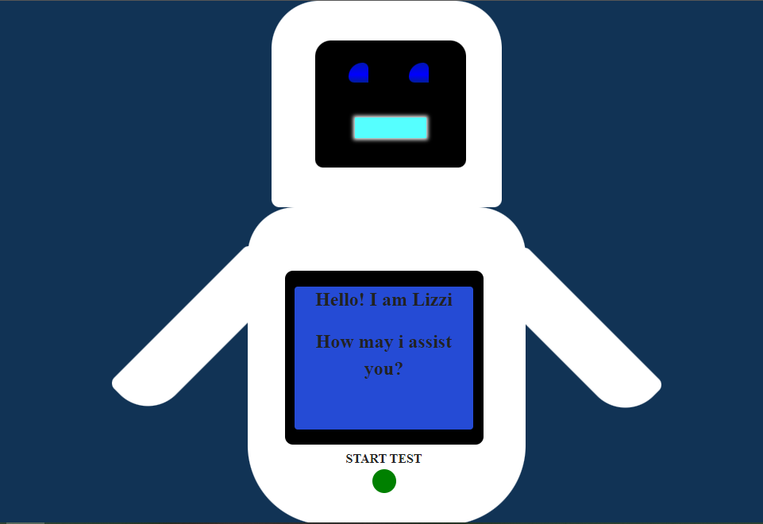

# Hospital Emergency Room Scenario (HERS)



This project uses finite state automation to simulate a test of a real-world process - _Hospital Emergency Room Scenario_ - in the browser.

The state diagram showing each transition can be found in the "**State Diagram**" folder.

***

## Instructions 

To interact with Lizzie, you must first clearly speak her name, then the commands from the list below.

```JSON
commands: [
		{
			"name": "Prepare for patient", 
			"key": "Prepare for patient",
			"response": {
				"positive": "Preparing for patient arrival",
				"negative": "Unable to take patient. Please reschedule."
			}
		},

		{
			"name": "Load existing info on patient",
			"key": "Load existing info on patient",
			"response": {
				"positive": "Loading existing info on patient",
				"negative": "I cannot find existing info on patient."
				}
		},
		{
			"name": "Request info on patient",
			"key": "Request info on patient",
			"response": {
				"positive": "Requesting info on patient",
				"negative": "Unsuccessful in requesting info on patient."
				}
		},
		{
			"name": "Reschedule procedure",
			"key": "Reschedule procedure",
			"response": {
				"positive": "Rescheduling procedure for patient",
				"negative": "I cannot reschedule this procedure for this patient."
				}
		},
		{
			"name": "Schedule New Procedure",
			"key": "Schedule New Procedure",
			"response": {
				"positive": "Scheduling New Procedure for patient",
				"negative": "You know i cannot reschedule a new procedure for this patient."
				}
		},
		{
			"name": "Schedule Test",
			"key": "Schedule Test",
			"response": {
				"positive": "Scheduling Test for patient",
				"negative": "Oh Dear, i am unable to schedule a test for this patient."
				}
		},
		{
			"name": "Reject Procedure",
			"key": "Reject Procedure",
			"response": {
				"positive": "Rejecting Procedure for this patient",
				"negative": "Unfortunately, i am unable to reject this patient's procedure."
				}
		},
		{
			"name": "Schedule Date",
			"key": "Schedule Date",
			"response": {
				"positive": "Scheduling a date for this patient",
				"negative": "Nope, i cannot schedule a date for this patient."
				}
		},
		{
			"name": "Prepare Referral",
			"key": "Prepare Referral",
			"response": {
				"positive": "Preparing a referral for this patient",
				"negative": "I cannot prepare a referral for this patient."
				}
		},
		{
			"name": "Assist with Procedure",
			"key": "Assist with Procedure",
			"response": {
				"positive": "Okay! let me assist with the procedure",
				"negative": "I cannot assist with this procedure."
				}
		},
		{
			"name": "Play Music",
			"key": "Play Music",
			"response": {
				"positive": "Alright! let me play some music",
				"negative": "I cannot play that music."
				}
		},
		{
			"name": "Play Video",
			"key": "Play Video",
			"response": {
				"positive": "Give me a second to play that video please",
				"negative": "Unable to play that video."
				}
		},
		{
			"name": "Request Drugs",
			"key": "Request Drugs",
			"response": {
				"positive": "Requesting drugs for the patient",
				"negative": "Unable to request drugs for the patient."
				}
		},
		{
			"name": "Get patient info",
			"key": "Get patient info",
			"response": {
				"positive": "Retrieving patient information",
				"negative": "That is a negative on retrieving patient information."
				}
		},
		{
			"name": "Pass instrument",
			"key": "Pass instrument",
			"response": {
				"positive": "Here is the instrument you asked for",
				"negative": "That instrument is not on the table, sorry."
				}
		},
		{
			"name": "Request Blood",
			"key": "Request Blood",
			"response": {
				"positive": "Okay, Give me a second while i request blood for the patient",
				"negative": "It would appear that i cannot request blood for this patient."
				}
		},
		{
			"name": "Call Specialist Doctor",
			"key": "Call Specialist Doctor",
			"response": {
				"positive": "Oh i know this person, let me see if they will take the call",
				"negative": "It would seem this person is occupied with something else because they are not taking the call."
				}
		},
		{
			"name": "Update Patient Records",
			"key": "Update Patient Records",
			"response": {
				"positive": "Okay, let me update the patient records",
				"negative": "Oops, i cannot update the patient records."
				}
		},
		{
			"name": "Recommendation",
			"key": "Recommendation",
			"response": {
				"positive": "Providing recommendation",
				"negative": "I cannot do that."
				}
		},
		{
			"name": "Feedback",
			"key": "Feedback",
			"response": {
				"positive": "Providing feedback",
				"negative": "I cannot provide feedback right now."
				}
		}
    ]
```